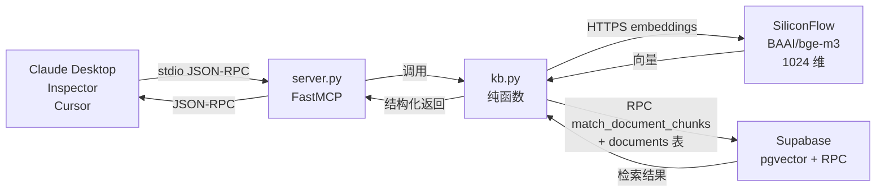

# kb-mcp-server

> 把 [ai-customer-service-saas](https://github.com/code-runner-xx/ai-customer-service-saas) 的 pgvector 知识库检索能力封装为标准 **MCP Server**:Tools / Resources / Prompts 三类协议消息全覆盖,Claude Desktop / MCP Inspector / Cursor 等任意 MCP 客户端零代码接入。

<!-- TODO: 公开后补徽章 -->
<!--    -->

---

## 🏗 架构与数据流



**关键路径**:客户端通过 stdio 与本 Server 通信(MCP 标准传输);Server 把查询文本送 SiliconFlow 生成 1024 维向量,再用 Supabase 的 `match_document_chunks` RPC 在 pgvector 上做 cosine 相似度检索,过滤 `user_id = KB_TENANT_ID` 实现租户隔离,最后把命中片段 + 文档标题拼回客户端。

---

## 🎯 三类消息设计

MCP 协议有三种"客户端 ↔ Server"消息类型,本项目各自落地一例,**三者触发方式不同**:

| 类型 | 名称 | 何时触发 | 客户端入口 |
|---|---|---|---|
| **Tool** | `search_knowledge_base` / `list_documents` / `get_document_content` | **模型决策**调用 —— 模型在对话中判断需要时自行触发 | 通常无需用户操作,模型自动调 |
| **Resource** | `kb://documents` | **客户端主动读取** —— 用户/客户端把它作为上下文挂载 | Desktop 的"附件/资源"面板手动选择 |
| **Prompt** | `kb_qa(question)` | **用户主动选用** —— 把原始问题包装成"先检索后作答 + 列来源"的指令 | Desktop 的 Prompts 面板 / 斜杠菜单 |

### 3 Tools(模型决策调用)
- **`search_knowledge_base(query: str, top_k: int = 5)`** — 语义检索,返回 `[{content, similarity, document_title}]`;`top_k` 钳制到 `[1, 20]`;阈值 `min_similarity = 0.3` 由 `kb.search` 内部控制,**不暴露给工具层**(见 [设计决策](#-设计决策))。
- **`list_documents()`** — 列出全部文档及元数据(id、标题、类型、状态、片段数、创建时间)。
- **`get_document_content(document_id: str)`** — 按 UUID 拉取并拼接全文(按 chunk 的 `metadata.index` 升序);超 8000 字符自动截断并标注原始长度。

### 1 Resource(客户端主动读取)
- **`kb://documents`** — 文档清单的只读快照,数据结构与 `list_documents` 一致。区别在**触发方式**:Resource 是客户端把它作为对话起手的背景资料,不依赖模型决策。

### 1 Prompt(用户主动选用)
- **`kb_qa(question: str)`** — 模板把用户问题包装为:
  > 基于知识库回答以下问题。请先调用 search_knowledge_base 检索相关片段,仅基于检索结果作答,不要编造;回答末尾列出来源文档标题。
  > 问题:{question}

---

## 📋 前置条件

- **Python 3.11**(已用 `.python-version` 锁定)
- **[uv](https://docs.astral.sh/uv/)** 包管理器
- 一个 **Supabase 项目**(免费档即可),含两张表 + 一个 RPC,SQL 见下方折叠块
- 一个 **[SiliconFlow](https://siliconflow.cn/)** API key(`BAAI/bge-m3` embedding,1024 维)

<details>
<summary><strong>📂 最小建表 SQL(展开)</strong>—— 让本 Server 检索路径可复现的最小 schema</summary>

```sql
create extension if not exists vector;
create extension if not exists pgcrypto;

create table public.documents (
  id uuid primary key default gen_random_uuid(),
  user_id uuid not null references auth.users(id) on delete cascade,
  title text not null,
  content_type text not null check (content_type in ('pdf','txt','url','docx')),
  source_url text,
  status text not null default 'processing' check (status in ('processing','ready','failed')),
  error_message text,
  char_count int default 0,
  chunk_count int default 0,
  created_at timestamptz default now()
);
create index documents_user_id_idx on public.documents(user_id);

create table public.document_chunks (
  id uuid primary key default gen_random_uuid(),
  document_id uuid not null references public.documents(id) on delete cascade,
  user_id uuid not null references auth.users(id) on delete cascade,
  content text not null,
  embedding vector(1024),
  metadata jsonb default '{}'::jsonb,
  created_at timestamptz default now()
);
create index document_chunks_user_id_idx on public.document_chunks(user_id);
create index document_chunks_document_id_idx on public.document_chunks(document_id);
create index document_chunks_embedding_idx on public.document_chunks
  using ivfflat (embedding vector_cosine_ops) with (lists = 100);

create or replace function match_document_chunks(
  query_embedding vector(1024),
  tenant_id uuid,
  match_count int default 5,
  min_similarity float default 0.3
)
returns table (id uuid, document_id uuid, content text, similarity float, metadata jsonb)
language sql stable as $$
  select dc.id, dc.document_id, dc.content,
         1 - (dc.embedding <=> query_embedding) as similarity,
         dc.metadata
  from public.document_chunks dc
  where dc.user_id = tenant_id
    and 1 - (dc.embedding <=> query_embedding) > min_similarity
  order by dc.embedding <=> query_embedding
  limit match_count;
$$;
```

> ℹ️ RLS 与完整业务 schema(聊天/反馈/订阅等)见 [ai-customer-service-saas 仓库](https://github.com/code-runner-xx/ai-customer-service-saas)。**本 SQL 仅为让本 MCP Server 的检索路径在你自己的 Supabase 项目中可复现**,不包含写入/管理/分析等业务表。Server 通过 Service Role Key 调用,会绕过 RLS,因此**所有 SQL 都显式带 `user_id = tenant_id` 过滤**,租户隔离不依赖 RLS。

</details>

---

## 🚀 Quickstart

### 1. 安装 uv(Windows PowerShell)

```powershell
powershell -ExecutionPolicy ByPass -c "irm https://astral.sh/uv/install.ps1 | iex"
```

> macOS / Linux 见 [uv 官方文档](https://docs.astral.sh/uv/getting-started/installation/)。

### 2. 克隆仓库 + 准备环境变量

```powershell
git clone https://github.com/<你的用户名>/kb-mcp-server.git
cd kb-mcp-server
Copy-Item .env.example .env
```

编辑 `.env` 填入四个值:

```
SUPABASE_URL=https://<your-project>.supabase.co
SUPABASE_SERVICE_ROLE_KEY=eyJ...
SILICONFLOW_API_KEY=sk-...
KB_TENANT_ID=<在你 Supabase auth.users 表里的 uuid>
```

### 3. 用 Inspector 调试(强烈推荐先走这一步)

```powershell
npx @modelcontextprotocol/inspector uv run server.py
```

浏览器自动打开 → Transport 选 `STDIO` → **Connect** → 切到 **Tools** 标签 → **List Tools**,应看到三个工具。在 `search_knowledge_base` 输入你知识库里有的关键词,验证能返回中文 JSON。

### 4. 接入 Claude Desktop

把 [claude_desktop_config.example.json](claude_desktop_config.example.json) 的内容合并到:

```
%APPDATA%\Claude\claude_desktop_config.json
```

按模板**把 4 个占位符替换为真值**(路径用 `\\` 双反斜杠;`env` 必须显式列全 4 个变量,Desktop 不继承终端环境变量)。

**完全退出 Desktop**(系统托盘右键 Quit,不是只关窗)→ 重启 → 输入框右下角应出现工具图标,展开能看到 `knowledge-base` 服务器。

---

## 🪤 Windows 踩坑记录

| 坑 | 现象 | 解法 |
|---|---|---|
| **stdio 禁 print** | 一行 `print()` 把 JSON-RPC 协议打挂 | 所有日志用 `logging`,默认走 stderr |
| **Desktop 改配置不生效** | 改了 config 重启 Desktop 工具仍未出现 | 系统托盘**右键 Quit** 才算完全退出,只关窗后台还在 |
| **`env` 不继承终端** | 终端能跑通,Desktop 起 Server 报缺 key | Desktop 配置 `env` 字段必须显式列全 4 个变量 |
| **`uv` 找不到** | Desktop 启动 Server 报 `command not found` | `command` 写完整路径 `C:\\Users\\<你>\\.local\\bin\\uv.exe` |
| **JSON 路径反斜杠** | 配置文件 parse 失败 | Windows 路径用 `\\` 双反斜杠转义 |
| **PowerShell GBK 渲染** | 中文输出看着是乱码 | 是**显示问题**而非数据问题;用 `'关键词' in output` 或 codepoint 验证实际内容 |
| **supabase 超时参数** | `ClientOptions` 报 `AttributeError: 'storage'` | 用 `SyncClientOptions`(基类无 `storage` 字段),不要用基类 `ClientOptions` |

---

## 🧭 设计决策

### 阈值 `min_similarity = 0.3`(与 SaaS 生产同源)
服务端把阈值锁定在 0.3,与上游 SaaS 生产值保持一致(同源)。**弱命中(similarity 在 0.3~0.5 之间)由客户端模型凭返回的 `similarity` 字段自行甄别**,服务端不在 MCP 层做精排。服务端精排(reranker)在 aisc V2 已另行验证,**不在本项目范围**。

阈值由 `kb.search` 的 `min_similarity` 形参控制(默认 0.3),透传给 RPC 第四参数;`search_knowledge_base` Tool **不暴露**此参数,业务行为锁定 0.3,只在测试/调试时用 `python -c "import kb; kb.search(..., min_similarity=0.99)"` 覆盖零命中分支。

### 固定 `KB_TENANT_ID` 租户隔离
租户 id 由环境变量写死,**绝不**作为工具参数暴露(否则等价于把租户穿越能力直接交给 LLM)。所有 SQL/RPC 都显式 `.eq("user_id", KB_TENANT_ID)`。

### 全只读最小权限
本 Server **不暴露任何写入/删除**操作。即便 Service Role Key 拥有全表写权限,工具层也仅提供 `search` / `list` / `get_content` 三个只读出口。

### Service Role Key 绕 RLS → SQL 显式过滤
因为用 Service Role Key 直连,会**绕过 Postgres RLS**。这正是租户隔离不依赖 RLS、必须自己在 SQL 里显式过滤 `user_id` 的原因。

### HTTP 超时 15s
embedding 与 RPC 正常 1-3s 完成,15s 是 5 倍余量;超时归 server 兜底 `检索服务暂时不可用:{ClassName}`。避免不可达或慢链路把客户端挂死。

### 异常文案"检索服务暂时不可用:{ClassName}"
故意保留异常类名(`AuthenticationError` / `ConnectError` / `APITimeoutError` / `APIError` / `BadRequestError`),让模型和运维能**粗略区分故障类型**,无需 `isinstance` 分支爆炸。完整堆栈走 `logger.exception` 进 stderr(铁律 1)。

---

## ✅ 手测清单

13 条用例覆盖正常路径 / Resource+Prompt / 已覆盖兜底 / 异常路径,详见 **[tests/manual_test.md](tests/manual_test.md)**,每条带"如何制造"+ 还原检查。

---

## 🐍 自写 Client(协议两侧)

除了 Claude Desktop / Inspector 这类现成客户端,本仓库还附带一个最小 Python Client `client_demo.py`,用官方 SDK 的 `stdio_client` + `ClientSession` 把 `server.py` 作为子进程拉起,**在同一 stdio 通道上把 Tools / Resources / Prompts 三类消息从客户端侧全覆盖**。

前置:在仓库根目录跑,且 `.env` 已填真值(子进程 server 会继承父进程环境)。

```powershell
uv run python client_demo.py
```

预期输出(节选):

```
============================================================
✅ 已连接 kb-mcp-server(stdio 子进程)
============================================================

[1/4] list_tools → 工具清单:
  - search_knowledge_base: 语义检索知识库,返回与查询最相关的若干片段(含相似度与所属文档标题)。
  - list_documents: 列出当前知识库的全部文档及元数据(id、标题、类型、状态、片段数、创建时间)。
  - get_document_content: 按 document_id 拉取并拼接单篇文档全文。

[2/4] call_tool('search_knowledge_base', ...) →
  命中 3 条
  首条 similarity     = 0.7240
  首条 document_title = lantu-x10-manual
  首条 content 前 100 字:...

[3/4] read_resource('kb://documents') → 文档标题清单:
  - lantu-x10-manual(chunk_count=...)

[4/4] get_prompt('kb_qa', question='滤网怎么保养?') → 渲染后模板:
  [user] 基于知识库回答以下问题。请先调用 search_knowledge_base 检索相关片段...
```

任何一步失败会直接 raise(非零退出码),便于 CI / 面试现场快速定位。

---

## 📜 License

[MIT](LICENSE)

---

## 🙏 致谢

本 MCP Server 复用 [ai-customer-service-saas](https://github.com/code-runner-xx/ai-customer-service-saas) 已部署的 Supabase 向量库与 SiliconFlow embedding,实现"零迁移"接入。MCP 协议与 SDK 来自 [Anthropic 官方](https://modelcontextprotocol.io/)。